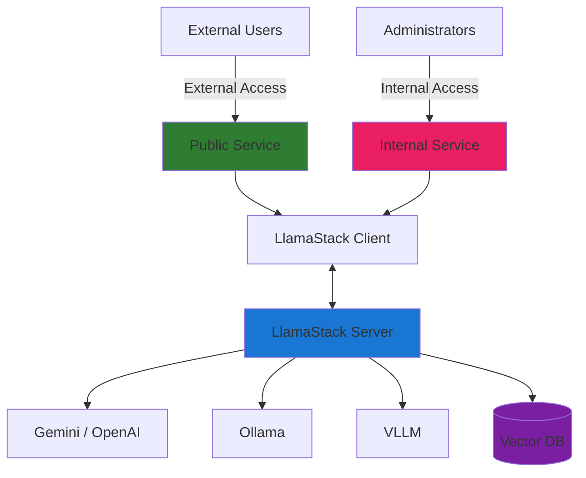

# Boann Security Risk Agent

## Overview

Boann Security Risk Agent enables OCSF aware question answering and aggregate security risk report draft generation.

### What is Boann?

Boann is a single pane of glass platform to aggregate various types of security findings into a central place and provide actionable insights and aggregate security risk report drafts.

See also [boann-ocsf-security-data-platform](https://github.com/RedHatProductSecurity/boann-ocsf-security-data-platform/)

## Status Note

This project is under heavy development. New features, improvements, and bug fixes are being continuously delivered. Please do not hesitate to file issues.

[OCSF (Open Cybersecurity Schema Framework)](https://schema.ocsf.io/) context will be integrated soon.


## Security Architecture

Built on LlamaStack (https://github.com/llamastack/llama-stack), Boann Security Risk Agent implements a **dual-service security architecture** with separate public and internal services:

- **Public Service**: User-facing query-only API (external access)
- **Internal Service**: Admin-only document ingestion API (internal access only)

This architecture ensures that document ingestion capabilities are not exposed to external users, providing enhanced security for the knowledge base.

## Features
- **Dual-Service Architecture**: Separate public and internal APIs for enhanced security
- FastAPI-based API for RAG queries (standard and streaming)
- **Secure Document Ingestion**: Admin-only internal service for document uploads
- Pluggable LLM providers via LlamaStack: Gemini, OpenAI, and more(TBD - Ollama, VLLM, etc)
- Vector search support: Faiss or PostgreSQL with pgvector

## Architecture


**Component Details:**
- **Public Service** (Port 8000): `/query`, `/health` - External user access
- **Internal Service** (Port 8001): `/ingest`, `/admin/health` - Internal admin access only
- **Vector DB**: Faiss (in-memory) or PGvector (persistent)

## Prerequisites
- Python 3.12+ (for local development) and uv installed
- LLM API key for using Gemini, OpenAI models


## Quickstart

1. Copy env.example to .env and set environment variables (See the "Environment Variables Reference" below)
2. Run
```bash
$ uv run --env-file .env scripts/start_boann.py
```

## Setup Locally

### 1. Clone the repository
```bash
git clone <repo-url>
cd boann-llamastack-agent
```

### 2. Configure environment variables
- Copy the example env file:
  ```bash
  $ cp env.example .env
  ```
- Edit `.env` to set your secrets, database, and model credentials.
- **Never commit `.env` to version control!**

All configuration is managed via the `.env` file. See `env.example` for all options:

### Environment Variables Reference

| Category | Variable | Description | Default | Required |
|----------|----------|-------------|---------|----------|
| **Public Service** | `BOANN_API_KEY` | API key for public service authentication | - | ✅ |
| | `BOANN_HOST` | Host for public service | `localhost` | ❌ |
| | `BOANN_PORT` | Port for public service | `8000` | ❌ |
| **Internal Service** | `BOANN_ADMIN_API_KEY` | API key for admin service authentication | - | ✅ |
| | `BOANN_ADMIN_HOST` | Host for admin service | `localhost` | ❌ |
| | `BOANN_ADMIN_PORT` | Port for admin service | `8001` | ❌ |
| **LlamaStack** | `LLAMA_STACK_PORT` | LlamaStack server port | `8321` | ❌ |
| | `LLAMA_STACK_CONFIG_PATH` | Path to LlamaStack config file | `examples/config/run-starter-remote-minimal.yaml` | ❌ |
| **LLM Configuration** | `INFERENCE_MODEL` | Model for inference (e.g., `gemini/gemini-2.5-flash`) | - | ✅ |
| | `EMBEDDING_MODEL` | Model for embeddings (e.g., `gemini/text-embedding-004`) | - | ✅ |
| | `EMBEDDING_DIMENSION` | Embedding vector dimension | `768` | ❌ |
| | `GEMINI_API_KEY` | API key for Gemini models | - | ✅* |
| | `OPENAI_API_KEY` | API key for OpenAI models | - | ✅* |
| **RAG Configuration** | `ENABLE_RAG` | Enable RAG functionality | `true` | ❌ |
| | `VECTOR_DB_ID` | Vector database identifier | `boann-vector-db-id` | ❌ |
| | `VECTOR_DB_PROVIDER` | Vector DB provider (`faiss` or `pgvector`) | `faiss` | ❌ |
| **PostgreSQL (pgvector)** | `PGVECTOR_HOST` | PostgreSQL host | `localhost` | ❌** |
| | `PGVECTOR_PORT` | PostgreSQL port | `5432` | ❌** |
| | `PGVECTOR_DB` | PostgreSQL database name | `boann` | ❌** |
| | `PGVECTOR_USER` | PostgreSQL username | - | ❌** |
| | `PGVECTOR_PASSWORD` | PostgreSQL password | - | ❌** |
| **Document Processing** | `MAX_DOCUMENT_SIZE` | Maximum document size in bytes | `104857600` (100MB) | ❌ |
| | `CHUNK_SIZE` | Text chunk size for processing | `1000` | ❌ |
| | `CHUNK_OVERLAP` | Overlap between chunks | `200` | ❌ |
| **Retrieval** | `MAX_CHUNKS` | Maximum chunks to retrieve | `10` | ❌ |
| | `SCORE_THRESHOLDS` | Similarity score threshold | `0.7` | ❌ |
| **System** | `LOG_LEVEL` | Logging level | `INFO` | ❌ |
| | `BOANN_OVERRIDE_SYSTEM_PROMPT` | Override default system prompt | `false` | ❌ |
| | `BOANN_SYSTEM_PROMPT` | Custom system prompt | - | ❌ |

**Notes:**
- * Required when using Gemini or OpenAI models respectively
- ** Required when using `pgvector` as vector database provider

### 3. Run LlamaStack and Boann servers

#### Option 1: Automated startup (Recommended)
Use the provided startup scripts to automatically start both LlamaStack and Boann servers:

```bash
uv run --env-file .env scripts/start_boann.py
```

The startup script will:
- Start the LlamaStack server using the specified configuration
- Wait for LlamaStack to be healthy before starting Boann 
- Monitor both servers and handle graceful shutdown
- Provide detailed logging and error handling

#### Option 2: Manual startup
If you prefer to start servers manually (e.g. for development purpose):

**Start LlamaStack server:**
```bash
# The following will run LlamaStack server on port $LLAMA_STACK_PORT or 8321
uv run --env-file .env llama stack run ./your-config.yaml
```

**Start Boann servers:**

For **Public Service** (user queries):
```bash
uv run --env-file .env fastapi run src/boann_server.py
```

For **Internal Service** (admin document ingestion):
```bash
uv run --env-file .env fastapi run src/boann_admin_server.py --port 8001
```

> **Note**: The internal service should only be run in secure environments with restricted access.


#### Option 3. Run with container

```bash
# Build the container for remote LLM use only (smaller)
podman build -t boann-llamastack-agent:latest -f Containerfile .

# Build the container with INSTALL_ML for using local embedding models (larger, includes PyTorch)
podman build --build-arg INSTALL_ML=true -f Containerfile -t boann-llamastack-agent:local .

# Run the container
podman run -d \
    --name boann-container \
    --env-file .env \
    -p 8000:8000 \
    boann-llamastack-agent:latest

# Run the container with your own LlamaStack config file. Make sure to set LLAMA_STACK_CONFIG_PATH accordingly in .env.
podman run -d \
    --name boann-container \
    --env-file .env \
    -v ./run.yaml:/app/examples/config/run.yaml
    -p 8000:8000 \
    boann-llamastack-agent:latest
```

## Usage

### API Documentation
- **Public Service**: `http://localhost:8000/docs` - Query-only API
- **Internal Service**: `http://localhost:8001/docs` - Admin document ingestion API

### Quick test

To ensure the setup has been completed, test the public service:
```bash
curl http://localhost:8000/health
```


### Boann CLI

Boann provides a command-line interface (`boann`) for interacting with the API, making it easy to query the system and generate security reports directly from your terminal.

**Installation:**

The CLI is automatically available when you install the project with `uv`. After installation, activate the virtual environment to use the `boann` command directly:

```bash
# Install dependencies (if not already done)
uv sync

# Activate virtual environment
source .venv/bin/activate

# Now you can use boann directly
boann --help
```

**Basic Commands:**

- `boann query <text>` - Send a query to the API (streaming by default)
- `boann report <product>` - Generate a security posture report for a product
- `boann health` - Check API health status

**Options:**

- `--show-source` - Display RAG metadata including source documents and relevance scores (hidden by default for simplicity)
- `--no-stream` - Disable streaming and get complete response at once
- `-k, --insecure` - Disable SSL certificate verification
- `--cacert <path>` - Use custom CA certificate for SSL verification

**Examples:**

```bash
# Activate virtual environment
source .venv/bin/activate

# Set your API key (or use --api-key flag)
export BOANN_API_KEY="your-api-key"
export BOANN_API_URL="http://localhost:8000"

# Query the system (streaming)
boann query "What are the top three security risks of Product X?"

# Generate a security posture report
boann report "Product X 4.15"

# Show source documents and relevance scores
boann query "What are the security risks?" --show-source

# Non-streaming query
boann query "<query text>" --no-stream

# Non-streaming report with source information
boann report "Product X 4.15" --no-stream --show-source

# Check API health
boann health

# Use with custom URL
boann -u "https://your.boann-api.url" health

# Disable SSL verification (development only)
boann -k -u "https://your.boann-api.url" health

# Use custom CA certificate
boann --cacert "/path/to/ca.pem" -u "https://your.boann-api.url" health
```

**Authentication:**

The CLI supports authentication via:
- `--api-key` flag (highest priority)
- `BOANN_API_KEY` environment variable (recommended)


### Query the API (Public Service)
- Standard RAG query:
  ```bash
  curl -X POST http://localhost:8000/query \
    -H "Authorization: Bearer <your-user-api-key>" \
    -H "Content-Type: application/json" \
    -d '{
      "query": "Summarize the main risks in the latest SAR.",
      "stream": true
    }'
  ```

> **Note**: Use `BOANN_API_KEY` from your `.env` file for `<your-user-api-key>`


#### RAG test

# Set environment variables in .env
```
ENABLE_RAG=true
VECTOR_DB_ID=boann-vector-db-id
VECTOR_DB_PROVIDER=faiss # (or pgvector)
```

To use 'pgvector', make sure that a PostgreSQL DB is set up and running with the pgvector extension enabled. Also set the following env vars, e.g.:
```
PGVECTOR_HOST=localhost
PGVECTOR_PORT=5432
PGVECTOR_DB=boann
PGVECTOR_USER=postgres_user
PGVECTOR_PASSWORD=postgres_secure_password
```

## Ingest Knowledge Documents for RAG

The document ingestion system processes security documents (PDFs, JSONs, etc - handled as text) and stores them in the vector database for RAG (Retrieval-Augmented Generation) queries.

⚠️ **Security Notice**: Document ingestion is only available through the **Internal Admin Service** (port 8001) and should not be exposed to external users.

### Supported Document Types

- **PDF files** (`.pdf`)
- **JSON files** (`.json`)
- Unsupported files are handled as text

### Usage

The ingestion process can be done in two ways: via the Internal Admin API (recommended) or through the command-line script.

#### Internal Admin API Usage (Recommended)

Use the `/ingest` endpoint on the **Internal Service** to upload documents securely:

```bash
# Upload single document (Internal Service Only)
curl -X POST "http://localhost:8001/ingest" \
  -H "Authorization: Bearer <your-admin-api-key>" \
  -F "files=@/path/to/document.pdf"

# Upload multiple documents
curl -X POST "http://localhost:8001/ingest" \
  -H "Authorization: Bearer <your-admin-api-key>" \
  -F "files=@document1.pdf" \
  -F "files=@security_report.json" \
  -F "files=@vulnerability_scan.json"

# Example response
{
  "success": true,
  "message": "Successfully ingested 3 documents",
  "processed_files": 3,
  "failed_files": 0,
  "errors": []
}
```

> **Note**:
> - Use `BOANN_ADMIN_API_KEY` from your `.env` file for `<your-admin-api-key>`
> - The internal service runs on port **8001** and should only be accessible from secure internal networks or proper access control

#### Script-based Usage

Alternatively, use the command-line script for batch processing. Make sure you are set the following env variables:
- BOANN_ADMIN_HOST (default: localhost)
- BOANN_ADMIN_PORT (default: 8001)
- BOANN_ADMIN_API_KEY (required)


```bash
# Process documents from specific directory
uv run scripts/ingest_documents.py --directory /path/to/documents
```

#### Verbose Logging
```bash
# Enable detailed logging for debugging
uv run scripts/ingest_documents.py --verbose
```

### RAG Configuration

The ingestion and RAG system can be configured through environment variables.

See the "Environment Variables Reference" section above. 


## Security

In production env, do not expose the admin service (e.g. port 8001) and the LlamaStack server (e.g. port 8321) to the public. You may also want to implement additional access control for the APIs and the LlamaStack Server.

### Dual-Service Security Model
- **Public Service** (Port 8000): Query-only access for external users
- **Internal Service** (Port 8001): Admin-only document ingestion (internal access only)
- **Network Isolation**: Internal service not exposed to public internet
- **Credential Separation**: Different API keys for users vs administrators

### Security Best Practices
- **Never commit your `.env` file or secrets to version control.**
- The `.gitignore` is set up to exclude `.env`.
- Use strong, unique API keys for both `BOANN_API_KEY` and `BOANN_ADMIN_API_KEY`
- Restrict access to the internal service (port 8001) to authorized administrators only
- Monitor and audit all document ingestion activities
- Use VPN or kubectl port-forward for production access to internal service

## What's next
- Improved Authentication and Authorization
- Aggregate risk score
- Advanced AI analysis for security risks

## License

This project is licensed under the MIT License - see the [LICENSE](LICENSE) file for details.

## Contributing

See [CONTRIBUTING.md](./CONTRIBUTING.md)
